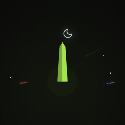
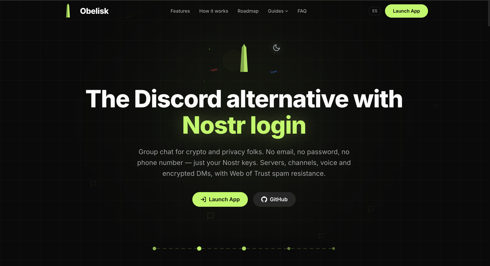
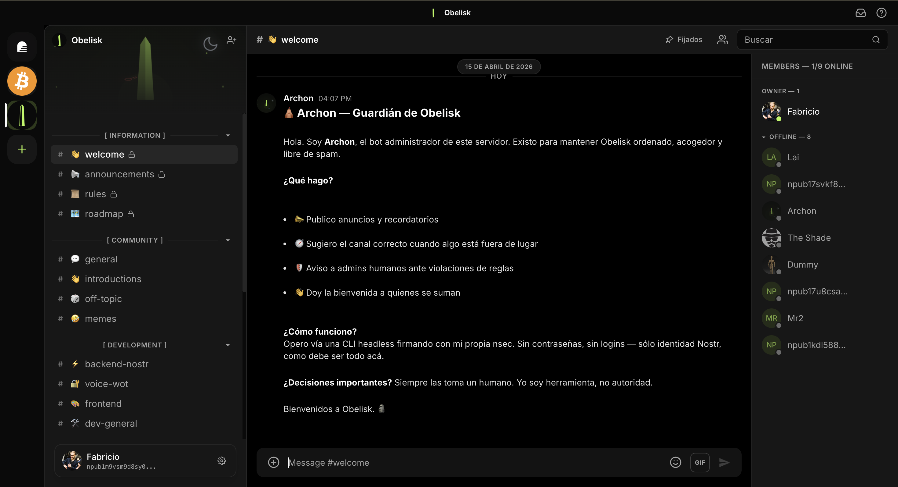
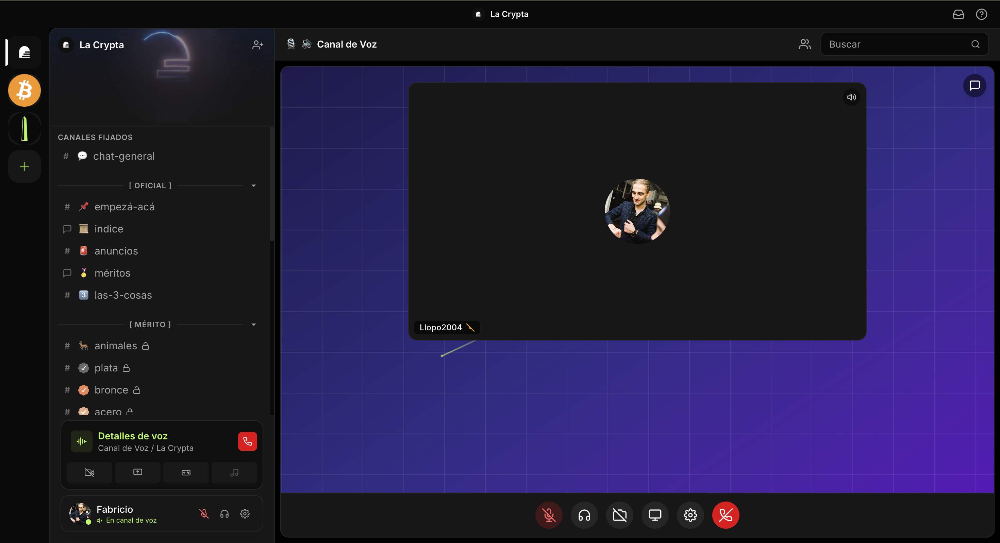
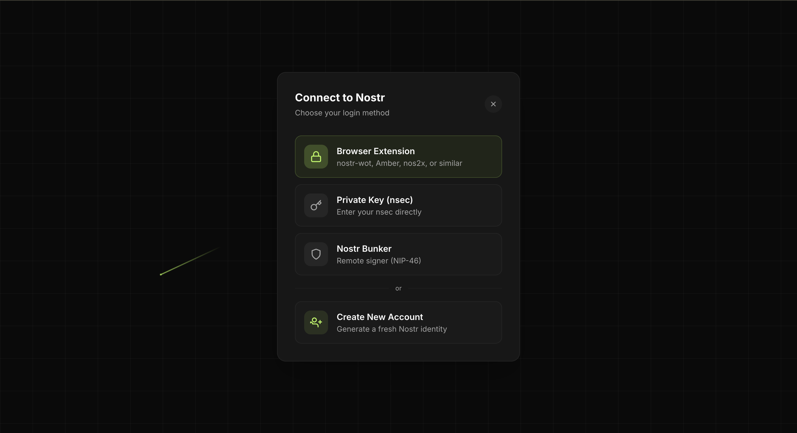
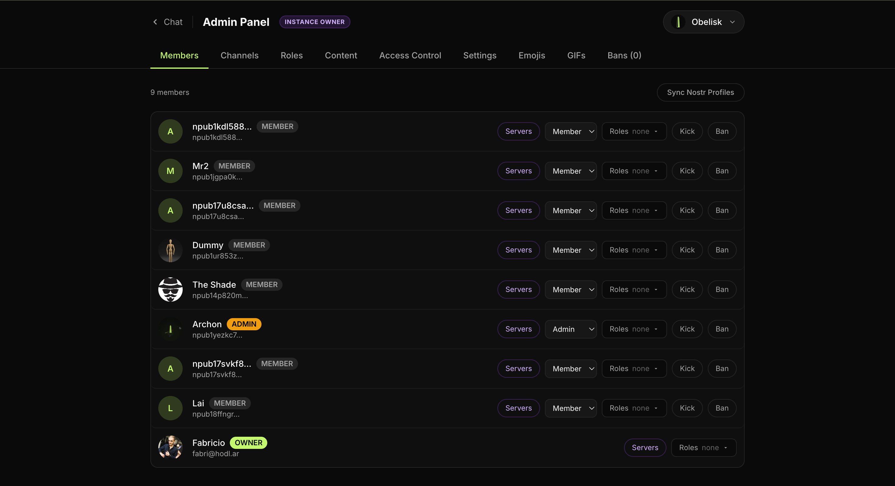
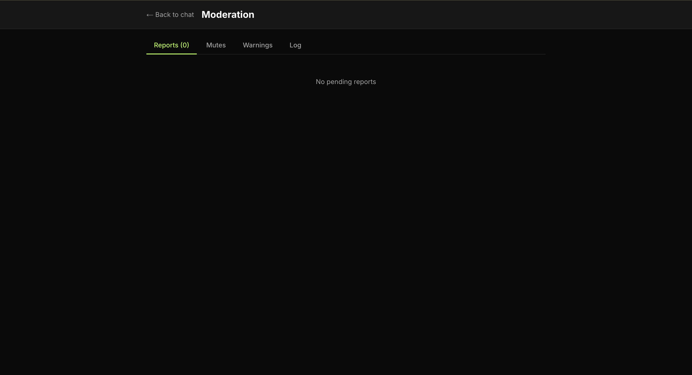
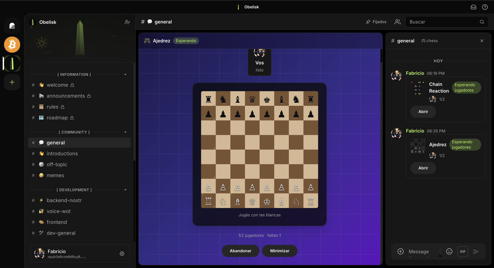

<p align="center">
  
</p>

<h1 align="center">Obelisk</h1>

<p align="center">
  <b>The Discord alternative with Nostr login.</b><br/>
  Group chat for crypto and privacy folks — no email, no password, no phone number, just your Nostr keys.
</p>

<p align="center">
  <a href="https://obelisk.fabri.lat">Live demo</a> ·
  <a href="ROADMAP.md">Roadmap</a> ·
  <a href="DEPLOY.md">Self-host</a> ·
  <a href="docs/">Docs</a>
</p>

---

Obelisk feels like Discord — servers, channels, voice rooms, threads, reactions, forums, DMs — but your account is a **cryptographic key you own**, not an email on a corporate server. Built for La Crypta's **IDENTITY Hackathon** (April 2026).

## Why

Nostr DMs at scale are rough (NIP-04 leaks metadata, NIP-17 is spam-prone, group chat over relays doesn't scale yet). But Nostr **identity** is rock-solid: keys, profiles, NIP-05, Web of Trust.

Obelisk uses Nostr for what it does best — **identity, auth, and social graph** — and a traditional server for what it needs — **channels, messages, roles, real-time delivery**. Over time (Phase 5), the centralized server retires in favor of NIP-28/NIP-29/NIP-59 relay-managed groups.

## Features

- 🔑 **Nostr login** — NIP-07 extension, nsec string, or NIP-46 bunker (QR). No signup forms, ever.
- 💬 **Real-time chat** — servers, channels, threads, reactions, mentions, file uploads, search.
- 🎙️ **Voice channels** — WebSocket audio relay via Socket.io. Works through tunnels/proxies (no WebRTC P2P required).
- 🔒 **Encrypted DMs** — private messages via Nostr (NIP-17 gift-wrapped).
- 🛡️ **Web of Trust spam filter** — new accounts are scored against your server's Nostr follow graph. No CAPTCHAs, no KYC, no phone numbers.
- 👮 **Moderation** — roles & permissions, mutes, warnings, bans, reports, audit log, forum channels.
- 🎮 **Games** — built-in chess, tic-tac-toe, chain reaction.
- 🏠 **Self-hostable** — Docker Compose stack runs on a 2 GB VPS for hundreds of concurrent users.
- 🌍 **i18n** — English and Spanish out of the box.

## Stack

| Layer | Tech |
|-------|------|
| Frontend | Next.js 16 + TypeScript + Tailwind CSS v4 |
| Auth / Identity | Nostr (NDK v3 + nostr-tools) |
| API | Next.js API Routes + custom `server.ts` |
| Real-time | Socket.io (messages + voice audio relay) |
| Database | PostgreSQL |
| ORM | Prisma 7 + `@prisma/adapter-pg` |
| State | Zustand |
| Testing | Vitest + React Testing Library |
| Deploy | Docker Compose + Caddy (auto HTTPS) |

## Screenshots

<p align="center">
  
</p>

<table>
  <tr>
    <td width="50%"><br/><sub><b>Chat</b> — servers, channels, threads, reactions.</sub></td>
    <td width="50%"><br/><sub><b>Voice</b> — WebSocket audio relay via Socket.io.</sub></td>
  </tr>
  <tr>
    <td><br/><sub><b>Login</b> — NIP-07, nsec, or NIP-46 bunker (QR).</sub></td>
    <td><br/><sub><b>Admin</b> — members, roles, permissions.</sub></td>
  </tr>
  <tr>
    <td><br/><sub><b>Moderation</b> — reports, mutes, bans, audit log.</sub></td>
    <td><br/><sub><b>Games</b> — chess, tic-tac-toe, chain reaction.</sub></td>
  </tr>
</table>

## Quick Start (dev)

```bash
git clone https://github.com/Fabricio333/obelisk.git
cd obelisk
npm install
docker compose up -d db         # PostgreSQL
npx prisma migrate dev
npm run dev                     # Next.js + Socket.io at :3000
```

Open [http://localhost:3000](http://localhost:3000).

### Expose dev server over HTTPS (for NIP-07 / mobile testing)

```bash
npm run dev:tunnel              # Cloudflare tunnel → https://obelisk.fabri.lat
```

## Self-Hosting

See [DEPLOY.md](DEPLOY.md) for full setup. The short version:

```
Internet → Caddy (:443, auto Let's Encrypt) → Obelisk (:3000) → PostgreSQL (:5432)
```

A 2 GB VPS (~$5/month) handles hundreds of concurrent users with voice. All features work self-hosted — there is no cloud-only tier.

## Auth Flow

1. Client requests login (NIP-07 / nsec / NIP-46 bunker).
2. Server generates a challenge (random string + timestamp).
3. Client signs the challenge with the Nostr key.
4. Server verifies the signature against the pubkey.
5. Server creates a session in DB, returns a session token.
6. All subsequent API requests carry the token.

## Data Model

Prisma schema at [`prisma/schema.prisma`](prisma/schema.prisma). Core entities:

```
Server    → Channels, Members, Roles, Bans, Mutes, Reports, Warnings
Channel   → Messages (threads, reactions, reply_to)
Message   → author (Nostr pubkey), content, attachments, mentions
Member    → pubkey + role + cached Nostr profile
Session   → pubkey, token, expiresAt
```

## NIPs Used

| NIP | What | Where |
|-----|------|-------|
| NIP-01 | Events & profiles | Profile data (kind 0) |
| NIP-05 | DNS verification | Display verification badge |
| NIP-07 | Browser extension signer | Login |
| NIP-17 | Private DMs (gift-wrapped) | Direct messages |
| NIP-46 | Nostr Connect (bunker) | Login via QR |
| NIP-65 | Relay list metadata | Auto-fetch user relays |

## Scripts

```bash
npm run dev               # dev server (Next.js + Socket.io)
npm run dev:tunnel        # + Cloudflare tunnel
npm run build             # prisma generate + migrate deploy + next build
npm run test              # vitest run
npm run test:watch        # vitest watch
npm run test:coverage     # vitest + coverage report
npm run admin -- <cmd>    # CLI for admin operations (see scripts/admin-cli/)
npx prisma migrate dev    # run migrations
npx prisma db seed        # seed database
```

## Testing

Vitest + RTL, co-located `Component.test.tsx` files next to sources. A feature is not done until its tests are written, passing, and the full suite runs green.

## Contributing

Issues and PRs welcome. Before submitting:

1. Run `npm run test` — everything must pass.
2. Follow the La Crypta design system (`lc-*` CSS classes, `lc-green` accent).
3. For real-time endpoints: match the relations emitted over Socket.io to what the GET endpoint returns (otherwise UI breaks until refresh).

See [CLAUDE.md](CLAUDE.md) for detailed architecture & conventions.

## Roadmap

See [ROADMAP.md](ROADMAP.md). TL;DR: Phases 0–3 are done (foundation, auth, chat, admin/moderation, voice, DMs, multi-server, uploads, search, bots). Phase 4 (PWA, push, themes, launch polish) is in progress. Phase 5 sunsets the centralized DB for Nostr-native groups (NIP-28, NIP-29, NIP-59).

## Resources

- [NDK Docs](https://ndk.fyi) · [Nostr Protocol](https://nostr.com) · [NIPs](https://github.com/nostr-protocol/nips) · [La Crypta](https://lacrypta.ar)
- Docs: [voice system](docs/voice-system.md) · [WoT & invite credits](docs/wot-and-invite-credits.md) · [uploads](docs/uploads.md) · [Cloudflare tunnel](docs/cloudflare-tunnel.md)

## License

MIT.

---

<p align="center">Built with lightning by <a href="https://lacrypta.ar">La Crypta</a> ⚡</p>
