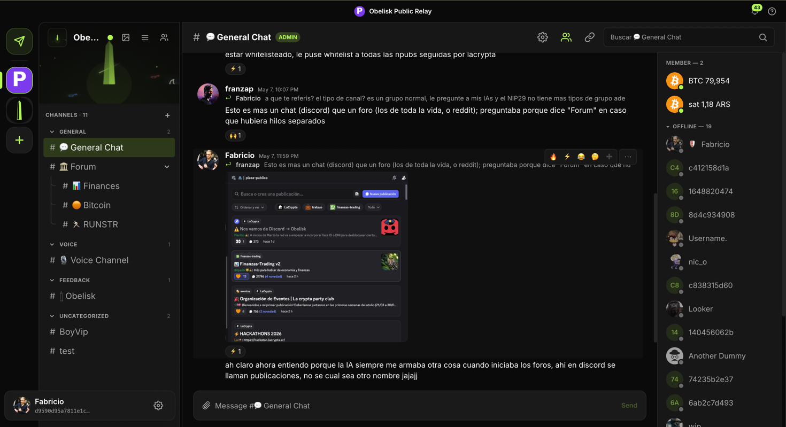
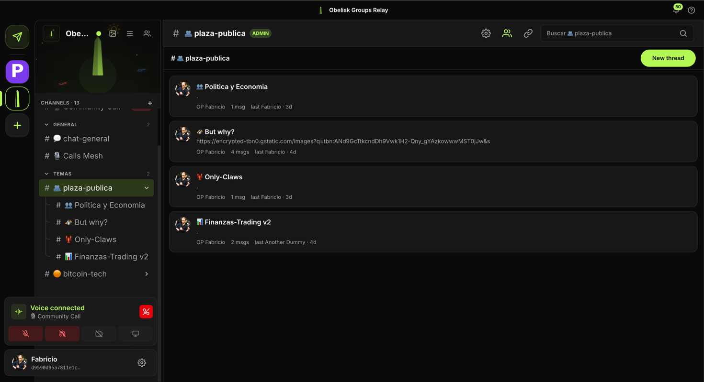
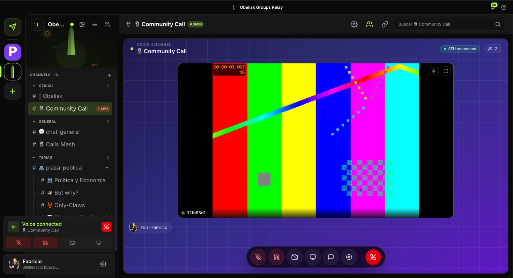
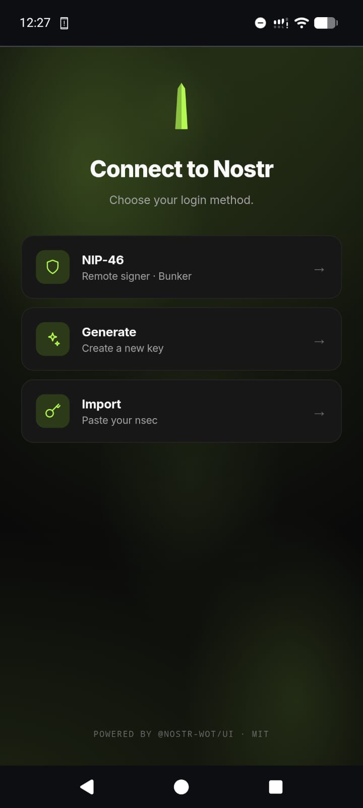
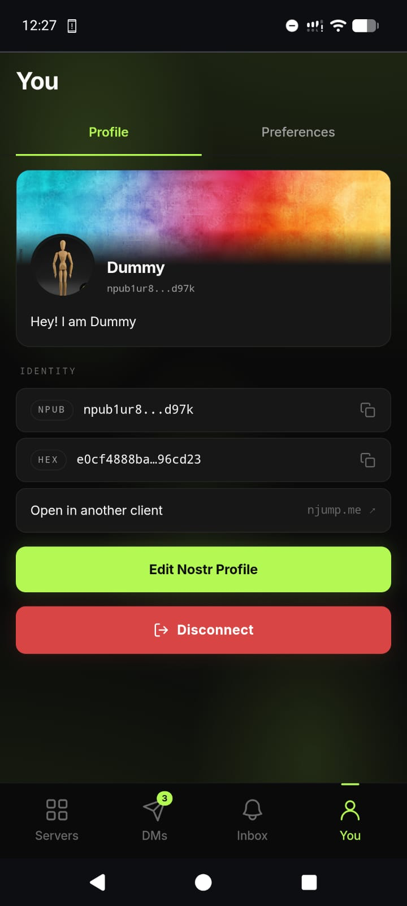
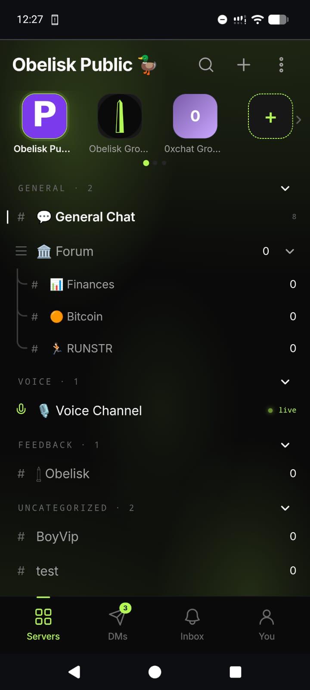
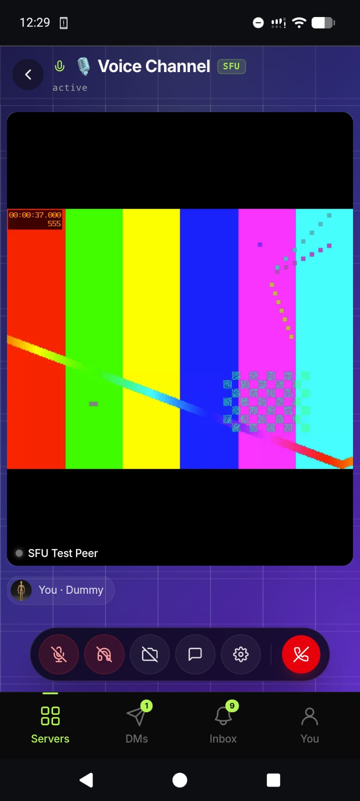

<p align="center">
  
</p>

<h1 align="center">Obelisk</h1>

<p align="center">
  <b>The Discord alternative with Nostr login.</b><br/>
  Group chat, voice, and DMs — no email, no password, no backend. Just your keys.
</p>

<p align="center">
  <a href="https://obelisk.ar">Live app</a> ·
  <a href="ROADMAP.md">Roadmap</a> ·
  <a href="docs/">Docs</a> ·
  <a href="#the-obelisk-family">Sibling repos</a>
</p>

<p align="center">
  <a href="https://github.com/obelisk-app/obelisk/stargazers"></a>
  <a href="https://obelisk.ar"></a>
  <a href="LICENSE"></a>
</p>

---

## What it is

A static Next.js app that talks **directly to Nostr relays**. Channels, members, admins, messages, DMs, voice, zaps — all reconstructed from NIP-29 / NIP-04 / NIP-17 events. There is no Postgres, no API server, no Socket.io — just the browser, a relay, and your keys.

## Why

- 🔑 **No personal data.** Identity is a Nostr keypair. No email, phone, name, or device fingerprint.
- 🛰️ **No backend to trust.** Group state lives on relays you choose. Anyone can run one.
- 🌐 **Trivially self-hostable.** Static export — deploys to any CDN.

## Screenshots

Full guided tours: [obelisk.ar/desktop](https://obelisk.ar/desktop) · [obelisk.ar/mobile](https://obelisk.ar/mobile).

### Desktop

<p align="center">
  
</p>

<p align="center"><sub>Public General Chat — server rail, channel list, message stream with reactions, and the live NIP-29 member list. Every message is a signed Nostr event.</sub></p>

<p align="center">
  
</p>

<p align="center"><sub>Forum-kind channels become Discord-style threaded boards — topic list, OP and last-reply metadata, same NIP-29 moderation as every other channel.</sub></p>

<p align="center">
  
</p>

<p align="center"><sub>Voice scales from a P2P mesh to a mediasoup SFU when the relay advertises one. Same UI, same kind-25050 signaling on Nostr — just more peers and screen-share.</sub></p>

### Mobile

<p align="center">
  
  &nbsp;
  
  &nbsp;
  
  &nbsp;
  
</p>

<p align="center"><sub>The three-way Nostr login (NIP-46 / generate / import) · your portable kind-0 Nostr profile · mobile-first server list · voice with SFU.</sub></p>

## Try it

| | |
|---|---|
| **Live** | [obelisk.ar](https://obelisk.ar) — public global server (~75 active users) |
| **La Crypta** | A community of 20+ migrated from Discord |
| **Self-host** | `git clone` + `npm run build` + serve. Bring your own relay. |

## Run locally

```bash
git clone https://github.com/obelisk-app/obelisk.git
cd obelisk
npm install
npm run dev          # http://localhost:3000
```

No `.env` needed for local dev — defaults to `wss://relay.obelisk.ar`.

For HTTPS dev (needed for NIP-07 / mobile testing): `npm run dev:raise` (requires a Cloudflare tunnel, see [docs/cloudflare-tunnel.md](docs/cloudflare-tunnel.md)).

## Architecture

```
Browser  ──►  nostr-tools SimplePool  ──►  wss://relay.obelisk.ar
                       │
              ┌────────┴────────┐
              │                 │
         src/lib/nostr-bridge   src/lib/voice
         (singleton + hooks)    (mesh + SFU)
```

- **Frontend:** Next.js 16 + Tailwind v4, purely client-rendered. No `/api/*` routes.
- **Bridge** (`src/lib/nostr-bridge/`): the canonical pool, identity, subscriptions, and React hooks. Read this first if you're contributing.
- **Voice:** P2P mesh by default; switches to mediasoup SFU automatically when one is advertised on the channel ([obelisk-app/obelisk-sfu](https://github.com/obelisk-app/obelisk-sfu)).
- **Cache:** localStorage stale-while-revalidate for instant first paint on reload.
- **Identity:** comes from the bridge — `useIsLoggedIn`, `useMyPubkey`, `useSignerReady`. **Don't introduce a backend session.**

See [CLAUDE.md](CLAUDE.md) for the full architecture and conventions.

## The Obelisk family

| Repo | What |
|------|------|
| [**obelisk-app/obelisk**](https://github.com/obelisk-app/obelisk) | This repo — the chat app (relay-only) |
| [obelisk-app/obelisk-relay](https://github.com/obelisk-app/obelisk-relay) | NIP-29 groups relay (Rust, fork of `verse-pbc/groups_relay`) |
| [obelisk-app/obelisk-sfu](https://github.com/obelisk-app/obelisk-sfu) | mediasoup SFU for voice channels (Node, Nostr-RPC signaling) |
| [obelisk-app/obelisk-bots](https://github.com/obelisk-app/obelisk-bots) | Nostr bots toolkit (price ticker, admin/welcome bots, agent-friendly CLI) |
| [obelisk-app/obelisk-classic](https://github.com/obelisk-app/obelisk-classic) | The original Postgres + Socket.io stack ([classic.obelisk.ar](https://classic.obelisk.ar)) |

## Auth

Three methods, all client-side:

| Method | How |
|---|---|
| NIP-07 extension | Click "Connect" — auto-detected (button hides if no extension) |
| nsec | Paste `nsec1...` |
| NIP-46 bunker | Paste a `bunker://` URL or scan a Nostr Connect QR |

Login persists in `localStorage`. NIP-42 AUTH is renegotiated on every relay reconnect via the bridge's `automaticallyAuth` callback.

## Features

- Real-time chat (groups, channels, reactions, mentions, NIP-50 search)
- Voice channels (P2P mesh, optional SFU for larger rooms)
- Encrypted DMs (NIP-04, NIP-65 relay routing)
- Bitcoin zaps in chat (NIP-47 NWC, wallet stays client-side)
- Operator-controlled branding & layout (NIP-78, kind 30078)
- Image uploads (Blossom BUD-01 + NIP-98 auth)

## NIPs used

NIP-01 · NIP-04 · NIP-05 · NIP-07 · NIP-29 · NIP-42 · NIP-46 · NIP-47 · NIP-50 · NIP-65 · NIP-78 · NIP-98

## Scripts

```bash
npm run dev               # dev server
npm run dev:raise         # dev + Cloudflare tunnel
npm run raise             # production deploy
npm run build             # next build
npm run test              # vitest
```

## Contributing

Issues and PRs welcome.

1. `npm run test` must pass.
2. Follow the La Crypta design system (`lc-*` CSS classes, `lc-green` accent).
3. Identity comes from the bridge — don't introduce a new auth store or backend session.
4. New relay-derived data goes through the bridge (StateStore + ingest method + subscribeXxx + useXxx hook).

See [CLAUDE.md](CLAUDE.md) for the full guide.

## Resources

- Docs: [auth & data loading](docs/auth-and-data-loading.md) · [voice system](docs/voice-system.md) · [SFU](docs/sfu-system.md) · [layout & branding](docs/relay-layout-and-branding.md) · [uploads](docs/uploads.md) · [Cloudflare tunnel](docs/cloudflare-tunnel.md) · [known bugs](docs/known-bugs.md)
- External: [Nostr](https://nostr.com) · [NIPs](https://github.com/nostr-protocol/nips) · [La Crypta](https://lacrypta.ar)
